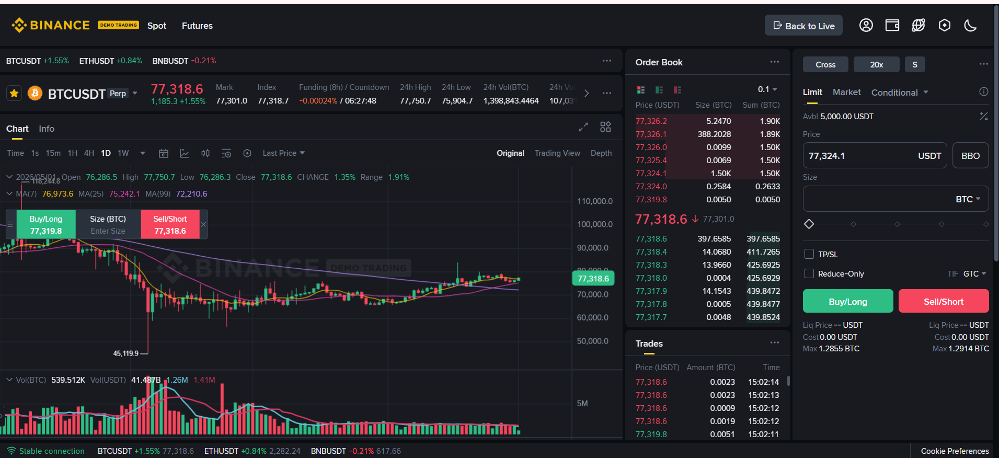
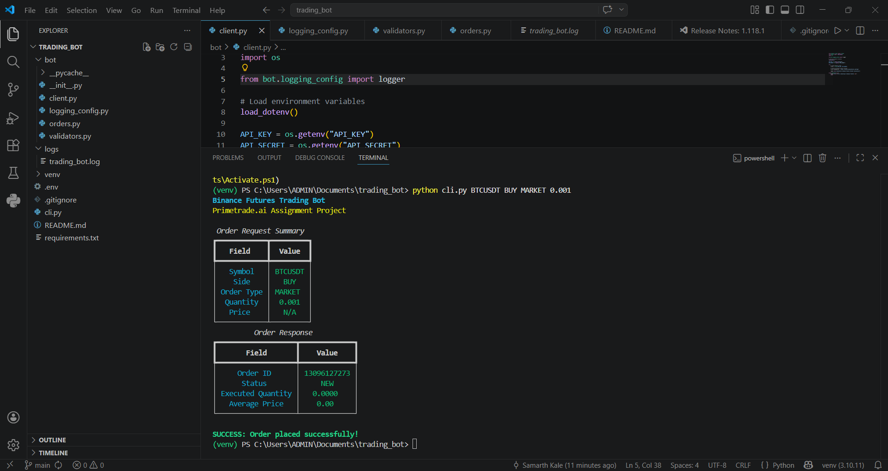
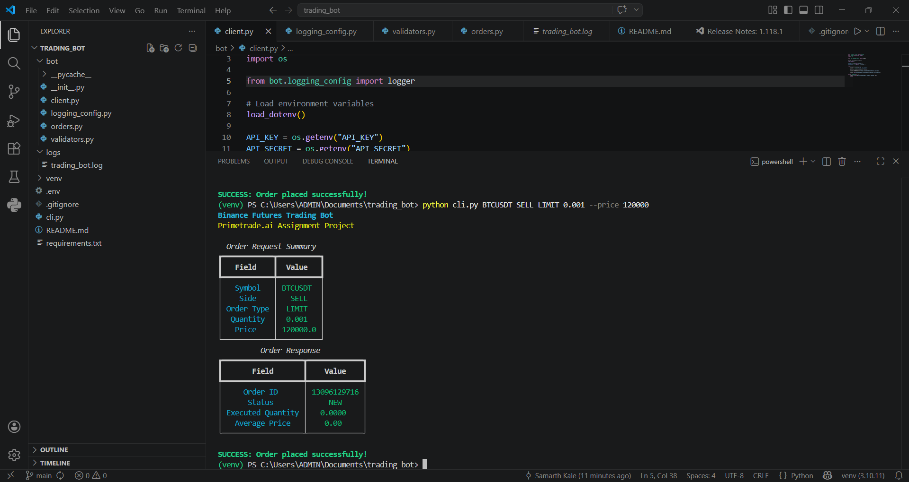
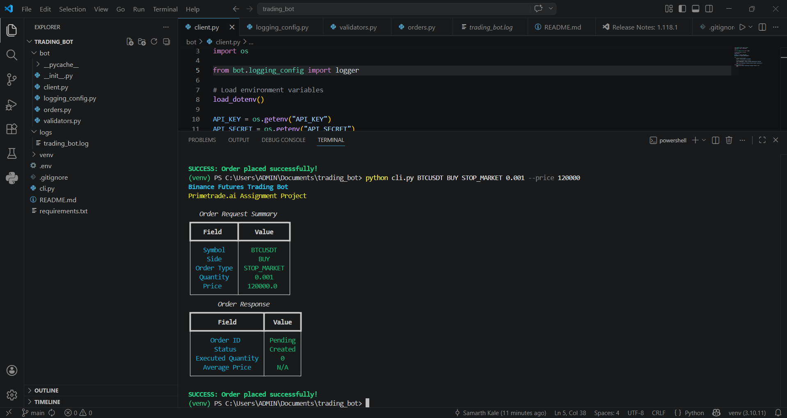
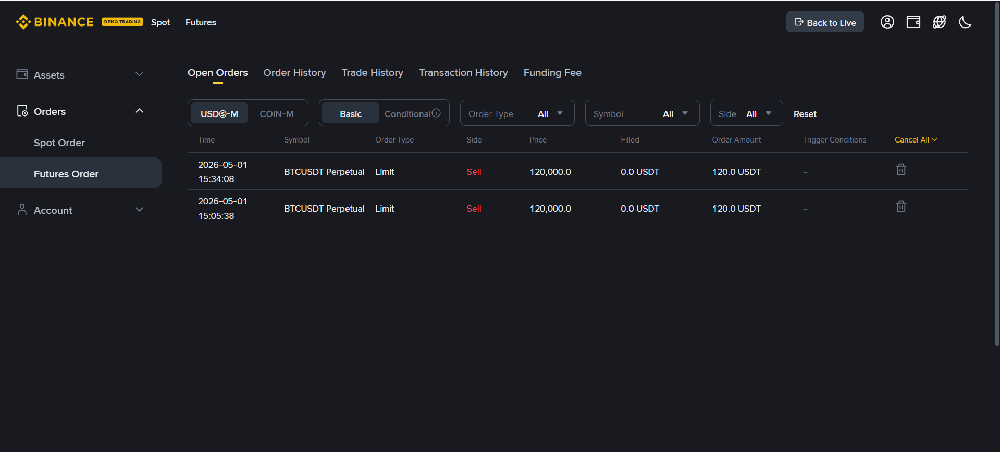
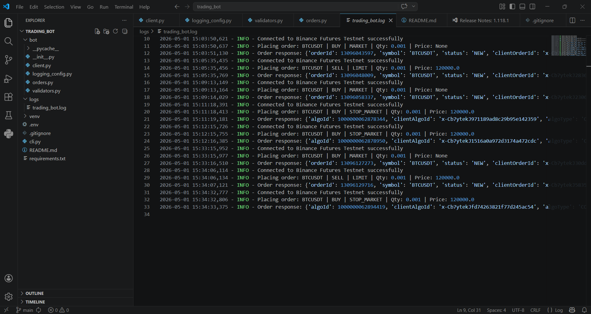

# Binance Futures Trading Bot

A professional Python-based trading bot built for Binance Futures Testnet (USDT-M).  
This project supports Market, Limit, and Stop Market orders through a clean CLI interface with proper validation, logging, and error handling.

---

# Features

- Place MARKET orders
- Place LIMIT orders
- Place STOP_MARKET orders (Bonus Feature)
- BUY and SELL support
- Binance Futures Testnet integration
- Structured modular architecture
- Input validation
- Logging system
- Exception handling
- Enhanced CLI UX using Rich + Typer (Bonus Feature)

---

# Tech Stack

- Python 3.x
- python-binance
- Typer
- Rich
- python-dotenv

---

# Project Structure

```text
trading_bot/
│
├── bot/
│   ├── __init__.py
│   ├── client.py
│   ├── orders.py
│   ├── validators.py
│   ├── logging_config.py
│
├── logs/
│   └── trading_bot.log
│
├── .env
├── cli.py
├── README.md
├── requirements.txt
```

---

# Setup Instructions

## 1. Clone Repository

```bash
git clone <your-github-repo-url>
cd trading_bot
```

---

## 2. Create Virtual Environment

```bash
python -m venv venv
```

Activate environment:

### Windows

```bash
venv\Scripts\activate
```

---

## 3. Install Dependencies

```bash
pip install -r requirements.txt
```

---

# Binance Futures Testnet Setup

1. Open Binance Futures Testnet
2. Create Testnet API Keys
3. Add keys inside `.env`

Example:

```env
API_KEY=your_api_key
API_SECRET=your_secret_key
```

---

# Usage

## MARKET Order

```bash
python cli.py BTCUSDT BUY MARKET 0.001
```

---

## LIMIT Order

```bash
python cli.py BTCUSDT SELL LIMIT 0.001 --price 120000
```

---

## STOP MARKET Order

```bash
python cli.py BTCUSDT BUY STOP_MARKET 0.001 --price 120000
```

---

# Logging

Logs are stored inside:

```text
logs/trading_bot.log
```

The log file contains:
- API requests
- API responses
- errors
- timestamps

---

# Validation Features

The application validates:
- Symbol format
- BUY/SELL side
- Order types
- Quantity
- Price for LIMIT and STOP_MARKET orders

---

# Error Handling

The bot handles:
- Invalid input
- Binance API errors
- Network failures
- Unsupported order types

---

# Assumptions

- The project uses Binance Futures Testnet only.
- Testnet API keys are required.
- Python 3.x is installed.

---

# Author

Developed as part of Primetrade.ai Python Developer Internship Assignment.
---


# Project Demonstration

## Binance Futures Demo Trading Dashboard

Demonstration environment used for testing Binance Futures orders on the Testnet platform.



---

## Market Order Execution

Successful MARKET order execution using the CLI trading bot.



---

## Limit Order Execution

Successful LIMIT order execution with custom price support.



---

## Stop Market Order Execution

Successful STOP_MARKET order implementation as an advanced order feature.



---

## Binance Open Orders Verification

Verification of orders directly inside Binance Futures Testnet dashboard.



---

## Logging System

Structured logging system capturing API requests, responses, and execution details.

